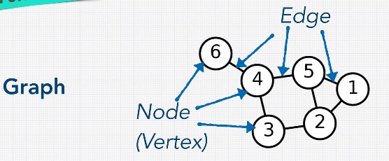
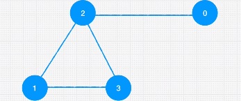

# Graph

A graph is a set of values that are related. There are connections \(edges\) to different nodes \(vertex\) in a graph.



There are 3 things to take note in a graph:

1. Directed vs Undirected. Undirected means I can go back and forth between nodes, like Facebook friends. Directed means I can only go in a specific direction, like Twitter where you follow, but the other person does not automatically follow you
2. Weighted vs Unweighted. Weighted means, besides value in the node, we can also have information on the edges. These sort of graphs are used a lot in calculating optimal paths / fastest way to destination.
3. Cyclic vs acyclic. Cyclic is the idea where the nodes are all interconnected and the idea is you can go back to the start

There are 3 different ways to represent graph:



* Edge List - simply shows the connection

```
const edgeList = [[0,2], [1,2], [2,3], [1,3]]
```

* Adjacent List - create a graph where the index is the node and the value is the nodes neighbors

```
const adjacentList = { 0: [2], 1: [2,3], 2: [0,1,3], 3: [1,2]}
//Node 0 is connected to 2, node 1 is connected to 2 and 3...
```

* Adjacent Matrix -  the matrix is going to have zeros and ones indicating whether the node X has a connection to node Y. Zero means no connection and One means yes. And if you have a weighted graph, you can actually add weights here, instead of 1 and 0.

```
 const graph = { 
  0: [0, 0, 1, 0], // index 0 has connection with 2 
  1: [0, 0, 1, 1], // index 1 has connection with 2 and 3 
  2: [1, 1, 0, 1], // index 2 has connection with 0, 1 and 3 
  3: [0, 1, 1, 0]  // index 3 has connection to 1 and 2
}
```

In the graph exercise, it is more useful to use object rather than array. Remember shifting on array is expensive. With objects we can quickly find items.

Pro of Graph: There are relationships

Cons of Graph: They can get complicated, thus scaling is hard

