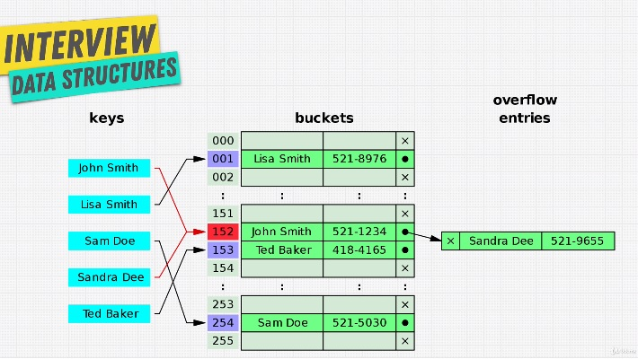

# Hash Table

Hash table has key-value pair. How it works is the KEY is used as the index of where to find the VALUE in memory. This is done with Hash Function - it is a function that generates a fixed value for each input that it gets \(idempotent\) 

Hash function is going to take the KEY and generate some sort gibberish number that convert into an address space and index space. Unlike array where there is ordered index, with hash table all we need is to give a key and we know exactly where that item is in our memory. 

* Search - O\(1\)
* Insert - O\(1\)
* Lookup - O\(1\)
* Delete - O\(1\)

Advantages of Hash Table

1. Fast lookup\* Good collision resolution needed
2. Fast insert - It is un-ordered thus we do not have to shift indexes like arrays
3. Flexible keys

Downside

1. Un-ordered - there is nothing to tell the hash function to evenly distribute data in the memory spaces. So there is a possibility of collision \(see picture\)
2. Slow key iteration - have to loop the entire memory space in order to find the keys VS array that just loop only the length of an array. If it has 3 keys, it would have looped over 3 times only

Collision - when you have collision, it slows down reading and inserting with a hash table, O\(n\) because if we have many data in one address space, we have to loop. One way to deal with collision is linked-list

Types of Hash Table:

1. Object - it allows only string keys, so if you pass a number or function, it get stringify
2. Map - it allows you to save any data type as key. Map maintain insertion order VS Object that does not maintain order, random insertion
3. Set - similar to Map. The only difference is that it only store the unique keys with no values

