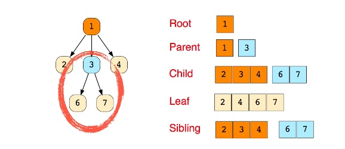

# Tree

Trees are data structures that have hierarchical structure as opposed to something like linked lists or arrays which are linear. But both linked list and tree use the same principle. They have nodes and these nodes can contain any type of information. Linked list is technically a type of tree, but with just one single path and it's linear - there's only one way to go from top to bottom VS tree that has multiple branches. Another difference is tree nodes can only point to a child, signifies as all the arrows point down. There's always one entry point which is the root, but nodes don't really have to reference their parent.

**Binary Tree**

Each node can only have either 0, 1 or 2 nodes and each child can only have one parent. 3 child nodes is not considered as Binary Tree. So there are Perfect Binary Tree, meaning a tree that is completely full. That means there are no gaps in the tree, all the leaf nodes are full and there's no node that only has one child, a node either has zero or two children. And also the bottom layer of the tree is completely filled. Vs Full Binary Tree where the bottom layer is not completely filled.

Perfect Binary Tree is desirable as it is really efficient. So it has 2 properties:

1. No of nodes double on each level down
2. No of nodes on the last level is equal to sum of the no of nodes on all other level + 1, which means half of our nodes are on the last level

By organizing our data in this way. If somehow we can avoid visiting every node, even if the node we're looking for is at the very bottom, there is some efficiencies, which is described as below.

* Lookup - O\(log N\)
* Insert - O\(log N\)
* Delete - O\(log N\)

Because total number of nodes is "2^height - 1" \(where height start from 1\). So, with 3 level, we are looking at 7 nodes. The equation is simplify as "log nodes = steps or height". So "log N" simply means based on the height, this is the maximum number of decision you have to make to do an operation \(lookup, insert, delete\). For example, with 3 level, the maximum step to search for a node is 3 nodes, instead of the whole 7 nodes, which is O\(n\) operation.

So, the meaning of O\(log N\) is the choice of the next element on which to perform an action is one of several possibilities and only one needs to be chosen and not both. A good example is searching for telephone in phone book where we use divide and conquer method. So O\(log N\) is even better than O\(n\) as we don't need to check every single element.

**Binary Search Tree**

The most common tree data structure is Binary Search Tree. As the name suggests, it is really good at searching. It does not have to iterate in linear fashion of each node like an array, so it is faster. And how is this better than hash table is because BST preserves the relationships, just like your computer folders that have sub-folder ans so on. With hash table, it is unordered.

The rules of BST:

1. All child nodes in the tree to the right of the root node must be greater than the current node. And vice versa for the left
2. Each nodes can have up to 2 child nodes

**Balanced BST vs Unbalanced BST**

Imagine a situation where we keep adding nodes to the right. As we add more, the tree will become unbalanced and imagine them without the left portion, it will look like a linked list. So, all of sudden, when we want to search, insert and delete, we need to loop every single node as worst case scenario. Thus, it becomes

* Lookup - O\(n\)
* Insert - O\(n\)
* Delete - O\(n\)

That is why Unbalanced BST is bad and ideally we want to balance our search tree so that we can have this performance optimization. Luckily for use, there are tools to help balance our BST: AVL Tree and Red Black Tree.

In summary, here are the pro and con of BST

* Better than O\(n\), assuming it is balanced
* Ordered
* Flexible size, as we can add nodes and grow the tree
* Bad: There is no O\(1\) operation

 Comparison with Arrays:

* BST wins in term of searching because you do not need to iterate, especially with array is unsorted. In term of insert and delete, unless it is at the end of the array, BST wins because with array, you need to shift index.

Comparison with Hash Table:

* Although hash table has O\(1\) for insert and search, BST has sorted data and we have the relationship

**AVL Tree and Red Black Tree**

Using AVL Tree or Red Black Tree, we can automatically rebalance our tree, so that we don't have those edge cases where our balanced tree turns into a linear unbalanced tree.

