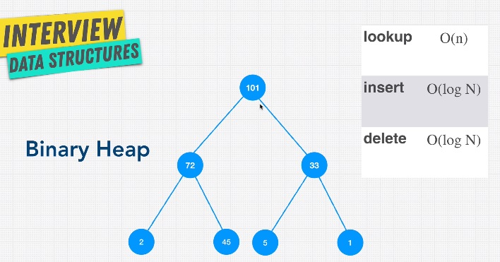

# Binary Heap

Binary Heap means every child belongs to a parent node that has a greater priority or value. The other name is max heap. Min heap is the opposite where the root node is the smallest. A heap can be used in any algorithm where ordering is important. Thus it is used in Priority Queue.

For lookup, it is O\(n\), compared to BST where it is O\(log N\) because Binary Heap is less ordered than a binary search tree. A binary search tree has meaning between left and right, where left is always less than the right. In a binary heap, it doesn't matter, left and right can be any value as long as it's less than the top value. When lookup for value 1, we have to go through every node. So, lookup become 0\(n\).

The advantage of binary heaps is great at doing comparative operations. If I want a value over 33, we just grab 1st and 2nd level, instead of going all the way down to the nodes. Compared to BST where this operation is O\(n\).

For insertion, it add value on the tree in order from left to right and then bubbles up. So the best scenario is  O\(1\) and worst O\(log N\)

The beauty of binary heaps is that they take up the least amount of space possible because it's always left to right insertion. So there's no concept of an unbalanced binary heap. 

In general, binary heaps have these advantages:

1. Better than O\(n\). Although searching is slower than BST, but we have concept of priority
2. Priority
3. Flexible size
4. Fast insert

The disadvantage is

1. Slow lookup. But great at finding max or min

