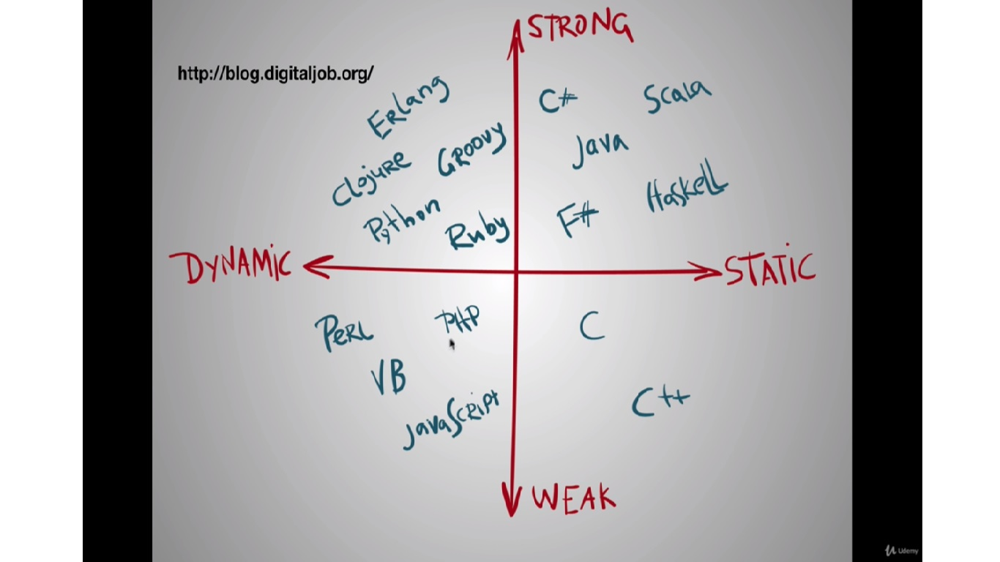

# Typescript

Typescript \(Static Type\) is a super set of vanilla JS \(Dynamic Type\), meaning it build on top of JS and has more features like types, classes and interfaces.

In static typed language, we have to declare the variable explicitly before using them.  Examples of types: string, number, boolean, Array&lt;string&gt;, object, null, undefined, void , enums, any.

```javascript
let myString: string     
//declate a variable with a type "string"

let anotherString = "This is a string without :string"  
// infer type "string" without declaration

let yetAnotherString     
//if not declared, the default is "any" which means any types
```

**Pros of static typing:**

1. We get self-documentation. In a project where the function is badly named or if it is a complicate function, we can immediately see what kind of parameter it expects and avoid making typing error
2. You are going to get less bugs, in regards to types. It catches errors at compile time and the code will not make it into production
3. This features helps with the auto completion in your IDE which in a way helps your development

**Cons of static typing:**

1. Make our code a little bit more harder to read
2. Why can't we just write better test to eliminate type error
3. Slower development process because you have these extra step of making sure there is no type errors. With dynamic typed language, you spend less time debugging syntax and semantic errors and instead spending more time debugging the logic and errors which to a developer are a lot more interesting

In summary, static types prevents bugs and helps keep errors from happening. Dynamic type allows you to be more flexible and write software faster.

**Strong vs Weak Type**

There is a confusion of mixed up between Static Type and Strong Type VS Dynamic Type and Weak Type.



```javascript
//Weak Type (example of type coercion in JS)
var a = "Hello"
a + 17   //return "Hello17"

//Strong type does not allow you to do the above. For example, Phython
```

**Why typescript?**

1. There are other "typescript-like" language, such as Flow, ReasonML and Elm. The difference between Typescript and Flow that TS has its own compiler while Flow use Babel as compiler. So, Flow has unnecessary extra code like \(@flow\) and depends on babel to remove these codes.
2. TS is JS basically, but a super set meaning it add extra features on top of JS. With ReasonML and Elm, they are completely separate language from JS. So TS can grow with JS.

TS is growing well and big part of that is because Angular is using TS. Why is that? Angular is like a kitchen and it is great for big companies to maker sure their massive developer team works within a kitchen that has already everything predefined like how to make soup, how to bake cake. Typescript adds an extra layer of security to make sure developer team play within the rules. So the rule of thumb of when to use TS is when your project grow larger and more developers are joining the team, you want your code to be self-documenting and also avoid bugs as more people touching the code.

**Why do we need Node to work with TS?**

TS need a compiler that turn our TS code into JS and this compiler needs to run somewhere and it need to have an environment, like Node. For being able to run JS because Node has JS engine \(Remember that JS is browser language\) that is V8 engine, same engine that Chrome has to read our JS and understand it

**How do we create TS project with React?** [**Here**](https://create-react-app.dev/docs/adding-typescript/)\*\*\*\*

