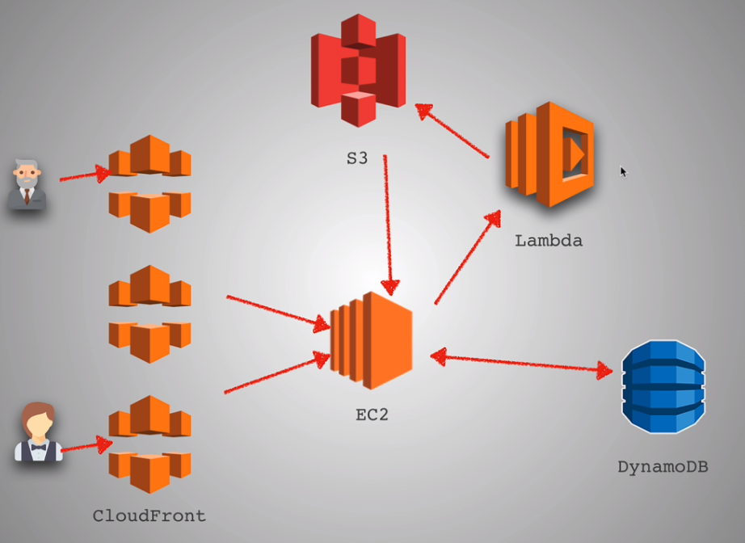

# AWS

AWS is Infrastructure as a Service or Platform as a Service. 

The benefits are:

* You select specific solution and only pay for exactly what you use
* Fast, high performance and scalability
* Ability to grow and shrink our infrastructure need based on our needs

**DevOps**

* EC2 - Think of it like a server that host your backend REST API
* S3 - Object storage service that can be accessed using key or ID and with that ID you can access whatever object that ID stores and it enables us to upload and download pretty much any file
* Lambda - We simply upload our code and Lamda takes care of everything required to run and scale your code. For example, a high request at the same time, lambda automatically is going to scale and will just create multiple instances of this function so that we can handle these requests with high availability.
* DynamoDB - NonSQL database \(key value storage\)
* Cloudfront - Web server that speeds up distribution of our static files and delivers this content through a world wide network of data centers exactly like a CDN does.

**Example of AWS Flow**

* With our app, we can ****have Cloudfront CDN all over the world so that when a user goes online from anywhere in the world they're served HTML, CSS and JS files from whatever service that is the closest.
* If the users make a request to our backend REST API which we can put on the EC2 instance.
* We can store user information in Dynamo DB 
* When the users submit an image, instead of having it work in EC2 because this machine is already busy listening to connections, we just trigger a lambda function that will take the URL of the image and send it to Clarify to get a response.
* Once the response is obtained, the response object is stored inside S3 that will be returned to EC2 when ready.

**Monolith vs Microservices**

Monolithic giant infrastructure or code base does everything for us with all the pieces all together in one place running our application and logic.

With docker and AWS, the idea of Microservices has become more popular. That is the idea to split your application into a set of smaller interconnected services that have its own architecture, consisting of its own business logic and concerned with doing one thing really well.

The benefit for Microservices is 

* Smaller chunks that can be tested on their own. In monolith, we have one giant codebase and we have to make sure nobody break anything and all the tests pass before we send it to production.
* Can have different developer teams on their own which means the services can be released individually to production at different time. 
* As long as we have Service Level Agreement \(SLA\) - meaning no matter what updates you do, you give me this return data or you respond to me this way.

