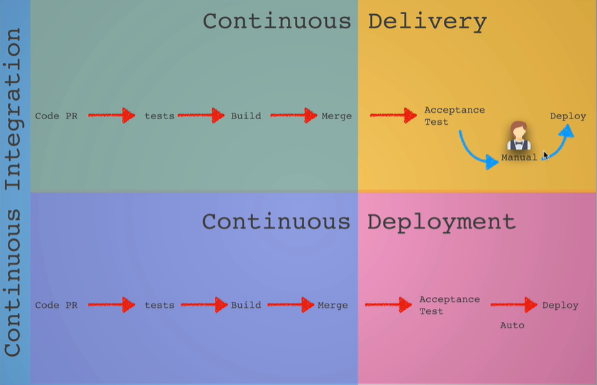

# CI/CD

**Problem:** old software practices is where everyone worked on a feature and they pushed the changes to the branch and it will sit until Friday to be merged. So when you make many changes at once, you would get conflicts and breaking codes.

**Solution:** Continuous Integration is development practice that helps to avoid the problem by having coders make pull requests daily and merging daily. It important that developers integrate their changes as soon as possible on the main repository, so that conflict are easily resolved because the changes are small and easily located. Other benefit is code consistency. Preferably CI / CD are set at the beginning of the project.

**Tools:** CircleCI \(hosted server\) or Jenkins \(your own managed CI server\) have a server that helps to run the CI/CD pipeline that includes testing, building and deployment

**Continuous Delivery / Continuous Deployment:** Continuous delivery is the practice of keeping your code base in a good state to be deployable at any point. The small difference with continuous deployment is continuous deployment goes straight into production without human intervention. That means there is no manual developer or QA that will do the acceptance tests. 

