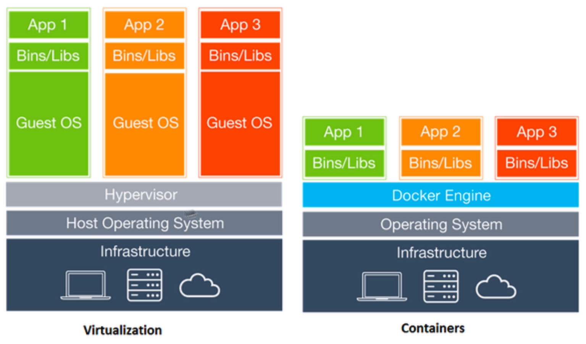
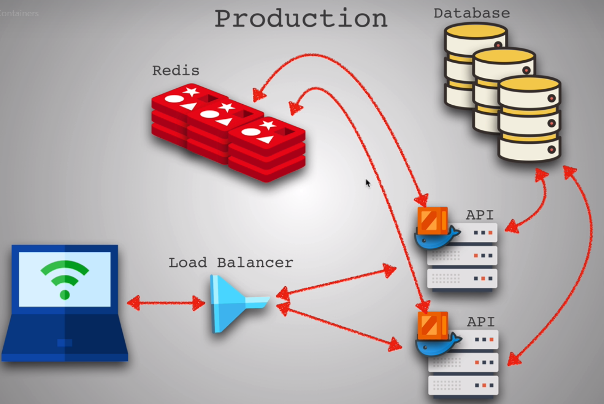

# Docker

The idea is to have project run on a different machine / environment without any errors. And this is where containers come in.

Companies uses micro-services and have their products composed of multiple layers. These layers can be considered services, each with their own container doing its own thing and communicating with each other to make the whole system work.

The problem with micro-services is each service may have its own requirements from different node versions to conflicting library dependencies. And when you add in the fact that every developer's machine and environment is different, it can be challenged to onboard new developers quickly or run this service on another machine. So, Docker come up with a solution that will run each application in a separate container with its own dependencies and its own libraries. Different containers are run on completely isolated environment but sharing the same OS kernel.

**History**

Before we have Docker, we have Virtualization / Virtual Machines or sometimes we called sandbox environments. It contains a full fledged computer with its virtual hardware operating system and as you can see in this diagram it's like having many computer sitting on top of another computer. This solves the problem because the app can run in an environment that is consistent and predictable. The downside is less speed.

**Docker**

Docker containers wrap up the software in a complete file system that contains everything they needs to run. 

Advantages: 

* Lightweight compare to VM because instead of virtual OS, it rely on host OS.
* Faster boot-up time
* Can only run single application on each container.
* Can be scaled up easily as you create more and more containers and use container orchestration like Kubernetes 

Characteristics:

* Each container has an image - Docker use this to bundle your application into a standalone executable package that can live inside of a container. For example, we want a node server, so this image is read by docker and it generates container that run node server for us.
* Each container environment is isolated from host machines. But compared to VM's complete isolation from each other, container has less isolation as more resources are shared between the containers, like kernel.
* Docker Hub is similar to NPM in JS land - it provides a store-like website where you can search and download images to use
* Image also has a file system just like we have files on our computer and that's what we call a volume.

But it is not one technology over the other. The best practice is to use both tech: virtualization and containers to utilize all the advantages. We may not provision for many virtual machine as before because one virtual machine will have hundreds of container instead of previous one VM for one container.

To summarize, Docker bundles your application into an image - a standalone executable package and Docker executes this image in this container and the environment inside the container is completely isolated from that of the host machine.

What can you containers? You can containerize everything and in the future that is how application is run, there is no more installing, they are just going to run it using docker and easily delete without extra clean up

