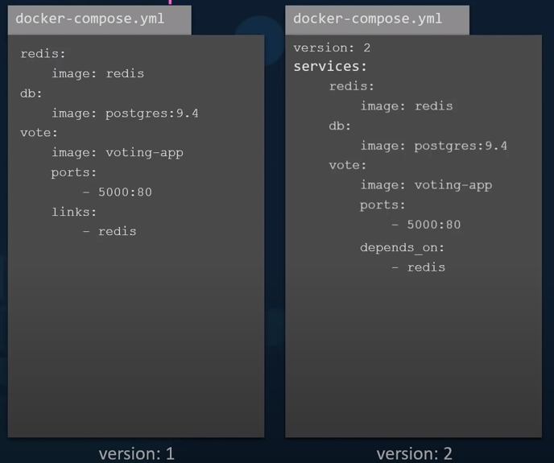
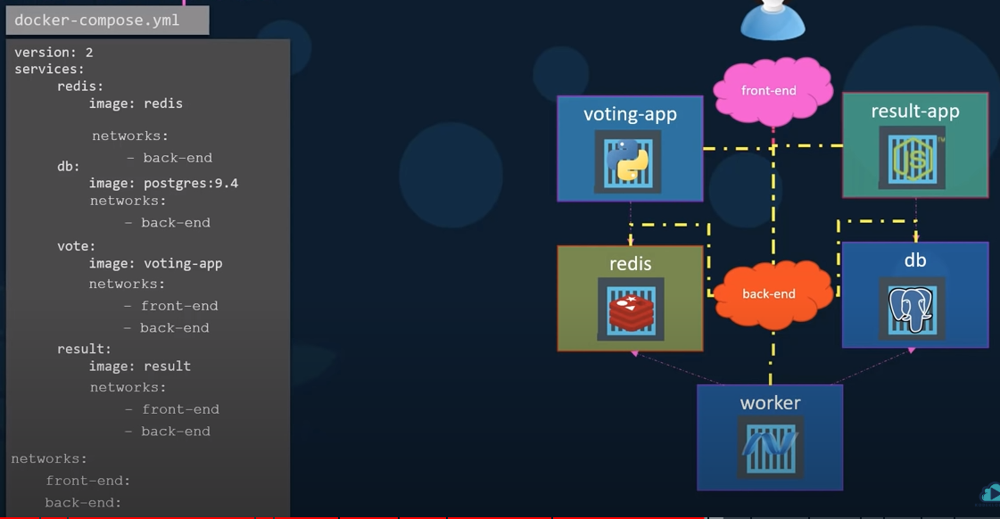

# Docker Compose


For your own application that is not available on the docker registry, if we want docker compose to run docker build instead of trying to pull an image, we can replace the image line with the build line and specify the location of a directory which contains the application code and the dockerfile with instruction to build the docker images. For example, if the voting app have all the application code in a folder named ./vote, then you write build: ./vote



Version 1 - you cannot deploy to other network \(other than the default bridge network and use links as communication between containers\) and specify the order of the services

Version 2 - you encapsulate all the services under services. You must specify the version at the top of the file. There is dedicated bridge network for this application and then attached all containers the new network, so they can communicate with each other using each other service name, so no need to use the links. You can add depend\_on property to the application to establish the dependencies



Lets say we want to create a front-end network dedicated for traffic from users and back-end network dedicated for traffic within the application. We then connect the front facing app \(voting app and result app\) to the FE network and all components to the internal back-end network

**Docker Compose**

Docker Compose to launch separate services under one command. So, it launches multiple container for each services: API Server, Postgres, Redis, etc. In other word, it orchestrate our application services during development.

Difference between Dockerfile and Docker-compose is Dockerfile is for one specific container only \(or one service\) and the docker-compose file is for composing more docker containers together \(many services\).

```text
Example of docker-compose file

version: 3.8

services:
  smart-brain-api:
    container_name: backend
    build: ./
    command: npm start
    working_dir: /usr/src/smart-brain-api
    ports:
      - "3001:3001"
    volumes:
      - ./:/usr/src/smart-brain-api
```

Version is the docker compose version based on your docker version \(docker -v\).

Services are these services are what we're going to orchestrate. Smart-brain-api is the name of the service.

Build is build image from Dockerfile which reside in the root folder.

Command is a command when the service starts.

Working directory is the directory of your working file. \(In this case, should be same as dockerfile working directory\)

Ports is for port binding.

Volumes is to have a connection or mounting whatever we have on our computer to the doctor container. \(aka to watch any changes\). Volume consist of ./ \(root directory on my local machine\) and I want to map it to the working directory that we have in our container \(/usr/src/smart-brain-api\). If there is an issue with update of nodemon, update the package.json file using "start": "nodemon -L server.js".

Volume allows us to access to the file system of the docker container. So, by putting volumes, we are having these files in our local computer mapped to where the container is the host file system. It is going to see the changes and update nodemon.

```text
docker-compose build
// build the docker-compose file

docker-compose run smart-brain-api
// run the smart-brain-api service (only one service)

docker-compose down
// to take down container running in the background

docker-compose up
// to run the service (bring up all the services that we put on docker-compose file)

docker-compose up --build
// to build and run service

docker-compose up -d
// To bring up all the services in the background

docker-compose exec smart-brain-api
// To enter the bash of the smart-brain-api after running in the background
```


