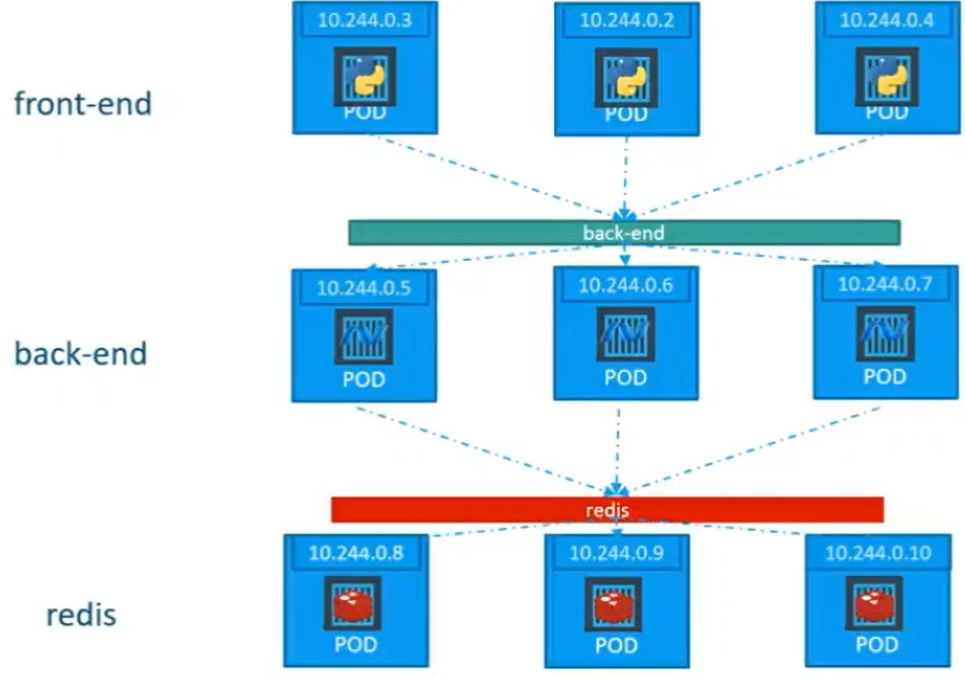
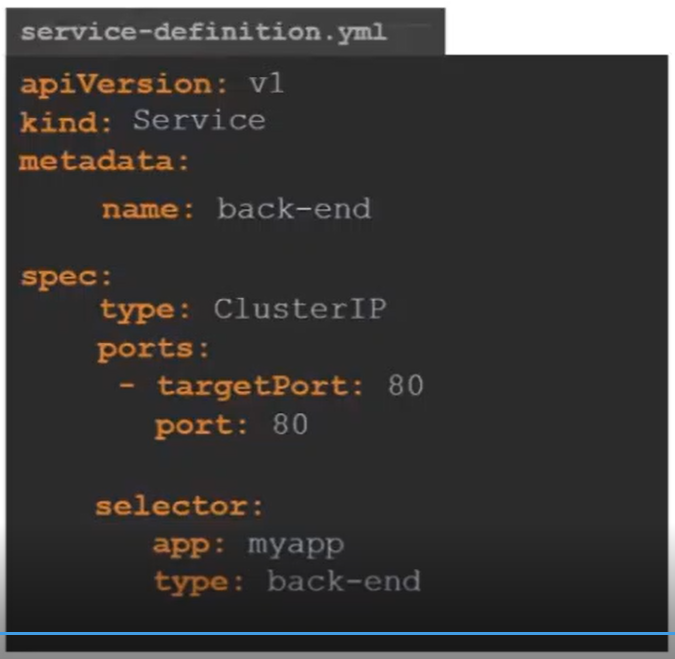

# Services

Kubernetes services are for:

* Enable communication between various components within \(frontend pods with backend pods\) and outside the application \(frontend pods with end users\)
* Create microservices architecture in our app

So how do you access the pod from your laptop?

For example,  Worker node has its IP add \(192.168.1.2\), Laptop has its IP add \(192.168.1.10\). There is internal pod network \(10.244.0.0\) and the pod own IP add \(10.244.0.2\). I cannot access the pod IP add as it is in the separate network. So what is the options to access?

* Not recommended - is to SSH into the Node port and from the node we can do a curl into the pod IP add or access the browser by typing http://10.244.0.2 if GUI is provided
* Recommended - Communication with the pod without SSH into the node, by simply just accessing the Node IP add. We need a middle ware that route request from our laptop to the Node and to the Pod. This middle ware is called Kubernetes Services. It is one of kubernetes object and this service is called Node Port.

There are 3 different kind of services:

* Nodeport =&gt; make the internal pod accessible though the node
* Cluster IP =&gt; create virtual IP inside the cluster to enable communication between different services such as a set of frontend pods to set of backend pods
* Load balance =&gt; provision load balancer for our application in the supported cloud providers


**Node Port Service**

Service is like a virtual server inside the node and has its own IP add called Cluster IP \(in the example above, the IP add is 10.106.1.12\).

The only mandatory field of ports is port. If target port is not defined, it is assumed to be same as port. If nodePort is not defined, it is assigned randomly a port within the valid range of 30000 - 32767.

Ports field in the yml file are in array meaning you can create multiple mapping port within a single service.

To connect service to the pod, we use the selector field from yml file and label from the pod. So if you have multiple pods with the same labels, it will be automatically under the services and considered them as endpoints to the forwarded external request coming from users. This is where the load balancing happen \(on random algorithm and session affinity is yes\).

What happens when multiple pods are distributed across multiple nodes ? Service automatically span across the Nodes in the cluster and map the target port across Nodes in the cluster to the single node port in this case 30008.


So you just curl into different node IP with the same node port**.**

```text
kubectl create -f service-definition.yml
// create service


kubectl get services
// list all services 
```

**Cluster IP Service**



How to establish this connectivity between these services?

The pods has it own IP add but these IP add is not static as the pod can go down and come back up with new IP, so we cannot rely on this internal pod IP add for communication.

Kubernetes will group these pod together and provide a single interface to access the pods in the group.

This makes it easy to create microservices app as each layer can scale and move without impacting the communication.

Each Cluster IP service get an IP and a name assigned it and that is the name that should be used by the pods to access the services.



