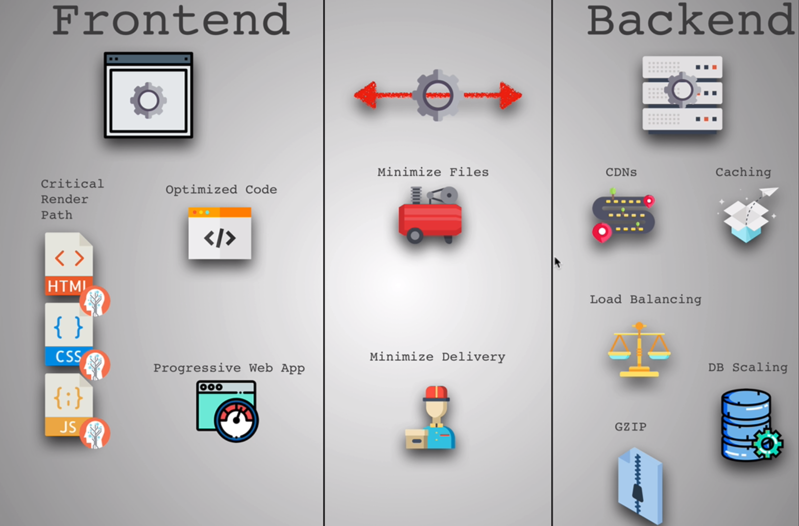

# Performance

Three places work need to happen when displaying the website \(and also places we can optimize\):

1. Frontend
2. The HTTP Request
3. Backend


1. Focus on the problem and finding the right solution
2. Comparison in number to see if your optimization have actually improve the speed


