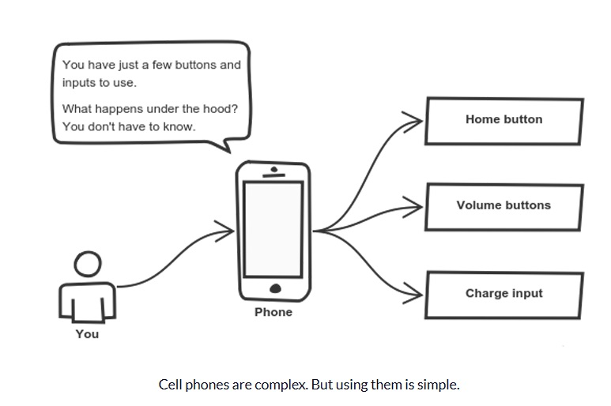
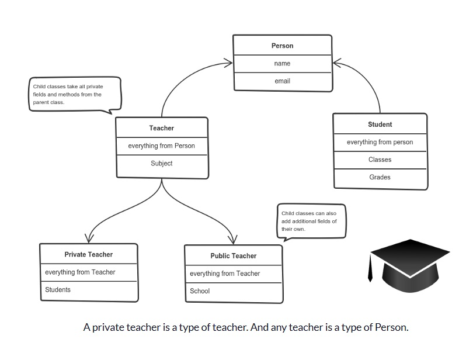
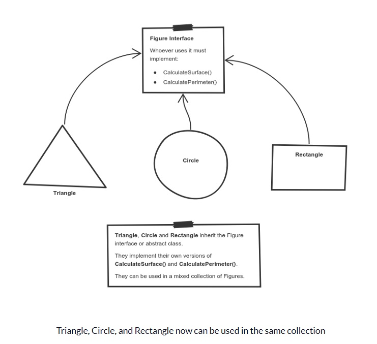

# 4 Pillars of OOP

**Encapsulation**

Encapsulation is achieved when each object keeps its state **private**, inside a class. Other objects don’t have direct access to this state. Instead, they can only call a list of public functions — called methods. So, the object manages its own state via methods — and no other class can touch it unless explicitly allowed. If you want to communicate with the object, you should use the methods provided. But \(by default\), you can’t change the state. Here the “state” of the cat is the **private variables** `mood`, `hungry` and `energy`. It also has a private method `meow()`_._ It can call it whenever it wants, the other classes can’t tell the cat when to meow. What they can do is defined in the **public methods** `sleep()`, `play()` and `feed()`_._ Each of them modifies the internal state somehow and may invoke `meow()`_._ Thus, the binding between the private state and public methods is made.


**Abstraction**

Applying abstraction means that each object should **only** expose a high-level mechanism for using it. This mechanism should hide internal, complex implementation details. It should only reveal operations relevant for the other objects. Benefits are firstly, reduce complexity as you have simpler interface object like mobile phone. Think of it as a small set of public methods which any other class can call without “knowing” how they work. Secondly, reduce the impact of change as we keep some of the properties and method private from outside. So imagine if we change the inner or private properties or method inside the object, it won't affect the rest of the object outside of it because no code is touching the inside code from outside. For example, implementation changes — for example, a software update — rarely affect the abstraction you use.



**Inheritance**

Help to eliminate redundant code. The idea is to create a super-class \(Human Being with properties of eyes, legs, hands, etc and method of talking, eating, etc\) and let the subclass - Male and Female inherit the property and methods super-class and at the same time, Female class can have their very own properties or methods \(like give birth\) than Male class cannot have and vice versa. This way, each class adds only what is necessary for it while reusing common logic with the parent classes.



**Polymorphism**

It is the ability to call the same method on different objects and each object responding in different way. We do this in 2 methods: Overwriting where the same method acts differently for each type of class and Overloading which is adding extra features or extra parameters to a method to add on to what the original method can do. This typically happens by defining a \(parent\) interface to be reused. It outlines a bunch of common methods. Then, each child class implements its own version of these methods. Thus, we don't have to necessarily copy and paste code over and over. We can reuse some of the functionality from a super-class to adapt to our own specific needs.

Take a look at a sketch of geometric figures implementation. They reuse a common interface for calculating surface area and perimeter: Having these three figures inheriting the parent `Figure Interface` lets you create a list of mixed `triangles`, `circles`, and `rectangles`. And treat them like the same type of object. Then, if this list attempts to calculate the surface for an element, the correct method is found and executed. If the element is a triangle, triangle’s `CalculateSurface()` is called. If it’s a circle — then cirlce’s `CalculateSurface()` is called. And so on. If you have a function which operates with a figure by using its parameter, you don’t have to define it three times — once for a triangle, a circle, and a rectangle. You can define it once and accept a `Figure` as an argument. Whether you pass a triangle, circle or a rectangle — as long as they implement `CalculateParamter()`, their type doesn’t matter.



```javascript
// Without Polymorphism
class Dog {
  woof() {
    console.log("i'm a dog, hear me woof!");
  }
}

class Cat {
  meow() {
    console.log("i'm a cat, hear me meow!");
  }
}

class Lion {
  roar() {
    console.log("i'm a lion, hear me roar!");
  }
}

var dog = new Dog();
var cat = new Cat();
var lion = new Lion();
var animals = [dog, cat, lion];

// this for-loop shows how messy things can get when we don't design
// our classes with polymorphism in mind.
for (let i = 0; i < animals.length; i++) {
  var currentAnimal = animals[i];
  if (currentAnimal.constructor === Dog) {
    currentAnimal.woof();
  } else if (currentAnimal.constructor === Cat) {
    currentAnimal.meow();
  } else if (currentAnimal.constructor === Lion) {
    currentAnimal.roar();
  }
}
```

```javascript
// With Polymorphism
class Animal {
  makeSound() {
    // do nothing, because we actually can't implement this method.
    // think about it. what sound does Animal make?
  }
}
class Dog extends Animal {
  makeSound() {
    console.log("i'm a dog, hear me woof!");
  }
}

class Cat extends Animal {
  makeSound() {
    console.log("i'm a cat, hear me meow!");
  }
}

class Lion extends Animal {
  makeSound() {
    console.log("i'm a lion, hear me roar!");
  }
}

var dog = new Dog();
var cat = new Cat();
var lion = new Lion();
var animals = [dog, cat, lion];

// Wow! polymorphism just made our life so much simpler!
// Now we can scale nicely to a circus with many more types of animals with ease!
for (let i = 0; i < this.animals.length; i++) {
  this.animals[i].makeSound();
}
```

