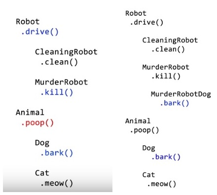

# Composition

Inheritance is when you design your types around what they are. Via inheritance. You can define the logic in a parent class and all children class can inherit it and reuse it.

Composition is when you design your types around what they do.Via Composition. You can define the logic in a helper class and then whoever need that function can keep a reference to that helper and reuse it.

Imagine we have two super-class: Robot and Animal. \(Left-Side\) How do we create Murder Robot Dog that can drive, kill, bark and not poop? \(Right-Side\) One way is to derive sub-class from Robot, but it will have unnecessary property and methods inherited.



```
// Composition to the rescue
const barker = state => ({
  bark: () => console.log("Woof, I am " + state.name)
});

const driver = state => ({
  drive: () => (state.position = state.position + state.speed)
});

const killer = () => ({
  kill: () => console.log("Woof, I am killer dog")
});

const murderRobotDog = name => {
  let state = {
    name,
    speed: 100,
    position: 0
  };

  return Object.assign({}, state, barker(state), driver(state), killer());
};

barker({ name: "karo" }).bark(); //Woof, I am karo
driver({ name: "ben", position: 100, speed: 10}).drive();

const sniffle = murderRobotDog("sniffles")
sniffle.bark();
sniffle.drive();
sniffle.kill();
```

You should favor composition over inheritance because inheritance encourages you to predict the future. You build the objects very early on in the project. And you are most likely going to make big design mistakes while doing that. Because humans cannot predict the future. It's just better to use composition from the start. It's more flexible, it's more powerful, and it's really easy to do.

However, that does not mean we should always avoid Inheritance. That's still a valid technique in OOP. Here is a rule of thumb to help you decide when to use Inheritance and when to use Composition.

* You should declare a class B inherits from class A only when there is a true `is-a` relationship between the two classes.
  * This means, don't let a class inherit another parent class just because you need to reuse some logic in parent class. Code reuse via composition could be a better choice here.
* You should compose class B with class A \(i.e. keeping a reference to class A in class B\) when there is a `has-a` relationship between the two classes.

