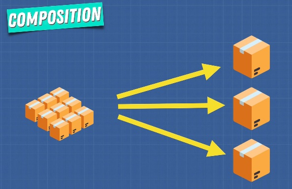
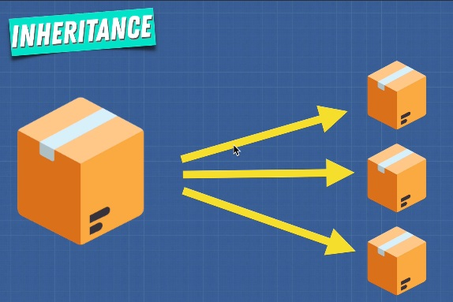

# OOP vs FP

The beauty of JS is that it is multi paradigm we can use both of these techniques that better suited to solve problems.

The basis of FP is Closure and the basis for OOP is Prototypes.

| FP | OOP |
| :---: | :---: |
| Many different operation on fixed data | Few operation on common data |
| Stateless - State is immutable | Stateful - State is modifiable |
| Pure - No side effect | Side effect |

